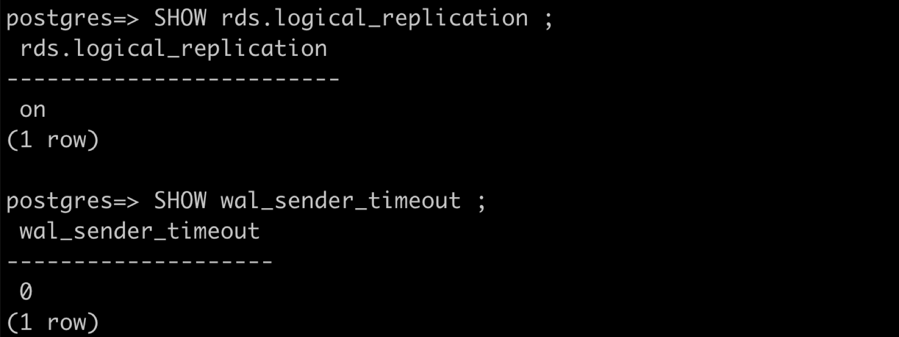
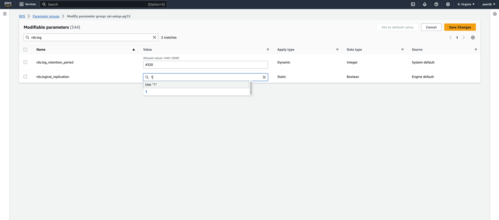
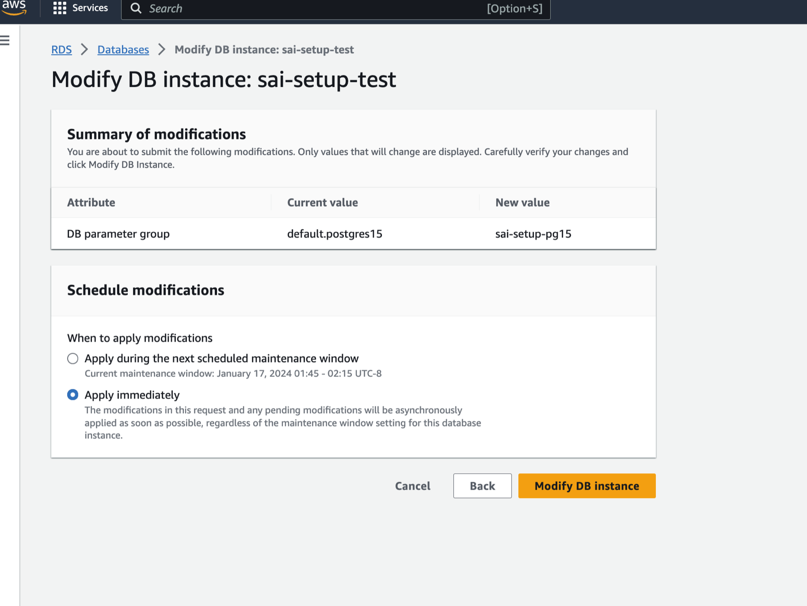
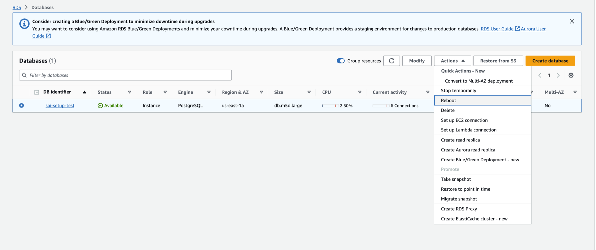
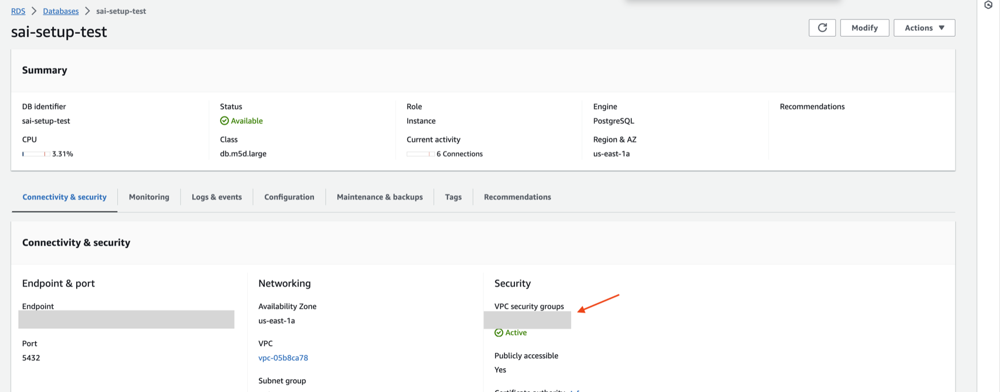
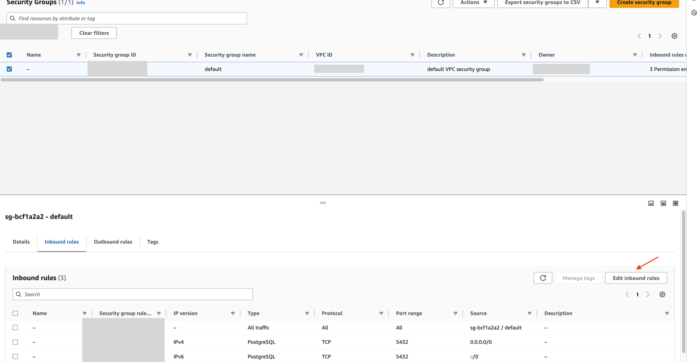

# RDS Postgres Source Setup Guide

## Supported Postgres versions

ClickPipes supports PostgreSQL version 12 and later.

## Enable Logical Replication

You can skip this section if your RDS instance already has the following settings configured:
- `rds.logical_replication = 1`
- `wal_sender_timeout = 0`

These settings are typically pre-configured if you previously used another data replication tool.



If not already configured, follow these steps:

1. Create a new parameter group for your Postgres version with the required settings:
    - Set `rds.logical_replication` to 1
    - Set `wal_sender_timeout` to 0

    

    

    

2. Apply the new parameter group to your RDS Postgres database

    

3. Reboot your RDS instance to apply the changes

    

## Configure Database User

Connect to your RDS Postgres instance as an admin user and execute the following commands:

1. Create a dedicated user for ClickPipes:

    ```sql
    CREATE USER clickpipes_user PASSWORD 'some-password';
    ```

2. Grant schema permissions. The following example shows permissions for the `public` schema. Repeat these commands for each schema you want to replicate:

    ```sql
    GRANT USAGE ON SCHEMA "public" TO clickpipes_user;
    GRANT SELECT ON ALL TABLES IN SCHEMA "public" TO clickpipes_user;
    ALTER DEFAULT PRIVILEGES IN SCHEMA "public" GRANT SELECT ON TABLES TO clickpipes_user;
    ```

3. Grant replication privileges:

    ```sql
    GRANT rds_replication TO clickpipes_user;
    ```

4. Create a publication for replication:

    ```sql
    CREATE PUBLICATION clickpipes_publication FOR ALL TABLES;
    ```


## Configure Network Access

If you want to restrict traffic to your RDS instance, please add the [documented static NAT IPs](../../index.md#list-of-static-ips) to the `Inbound rules` of your RDS security group.




